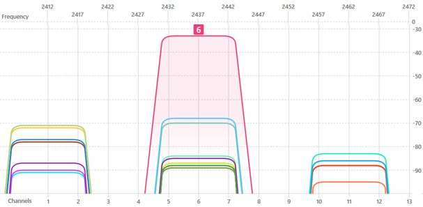

# JamShield: A Machine Learning Detection Algorithm for Over-the-Air Jamming Attacks

This repository contains the dataset used in the research paper "**JamShield: A Machine Learning Detection Algorithm for Over-the-Air Jamming Attacks**." The research was conducted by Ioannis Panitsas, Yagmur Yigit, Leandros Tassiulas, and Leandros Maglaras from Yale University and Edinburgh Napier University.

For any inquiries, please contact Ioannis Panitsas at [ioannis.panitsas@yale.edu](mailto:ioannis.panitsas@yale.edu).

## Dataset

Each dataset corresponds to a specific jamming type. We have implemented three types of jammers: constant, random, and reactive, each with varying output power and different jamming signals.We also include datasets without the presence of a jammer. You can access the raw files in the `data` folder:

- [Constant Jammer](data/)
- [Random Jammer](data/)
- [Reactive Jammer](data/)

Each dataset file contains the following features:

| Feature Name                                             | Description                                                                                           |
|---------------------------------------------------------|--------------------------------------------------------------------------------------------------------|
| sample                                                  | Unique identifier for each data sample.                                                                |
| station                                                 | MAC Address for the station transmitting the data.                                                     |
| tx_total_pkts                                           | Total number of packets transmitted.                                                                   |
| tx_total_bytes                                          | Total number of bytes transmitted.                                                                     |
| tx_ucast_pkts                                           | Number of unicast packets transmitted.                                                                 |
| tx_ucast_bytes                                          | Total bytes of unicast packets transmitted.                                                            |
| tx_mcast_bcast_pkts                                     | Number of multicast and broadcast packets transmitted.                                                 |
| tx_mcast_bcast_bytes                                    | Total bytes of multicast and broadcast packets transmitted.                                            |
| tx_failures                                             | Number of transmission failures.                                                                       |
| rx_data_pkts                                            | Number of received data packets.                                                                       |
| rx_data_bytes                                           | Total number of bytes received in data packets.                                                        |
| rx_ucast_pkts                                           | Number of unicast packets received.                                                                    |
| rx_ucast_bytes                                          | Total bytes of unicast packets received.                                                               |
| rx_mcast_bcast_pkts                                     | Number of multicast and broadcast packets received.                                                    |
| rx_mcast_bcast_bytes                                    | Total bytes of multicast and broadcast packets received.                                               |
| rx_decrypt_succeeds                                     | Number of successful decryption attempts for received packets.                                         |
| tx_data_pkts_retried                                    | Number of data packets that were retried for transmission.                                             |
| tx_total_pkts_sent                                      | Total number of packets sent, including retransmissions.                                               |
| tx_pkts_retries                                         | Total number of packet retries during transmission.                                                    |
| tx_pkts_retry_exhausted                                 | Number of packets that reached their retry limit without successful transmission.                      |
| rx_total_pkts_retried                                   | Number of received packets that were retried during reception.                                         |
| rate_last_tx_pkt_min                                    | Minimum transmission rate for the last transmitted packet (in kbps).                                   |
| rate_last_tx_pkt_max                                    | Maximum transmission rate for the last transmitted packet (in kbps).                                   |
| per_antenna_rssi_last_rx_data_frame_1-4                 | RSSI for the last received data frame per antenna.                                                     |
| per_antenna_avg_rssi_rx_data_frames_1-4                 | Average RSSI for received data frames per antenna.                                                     |
| per_antenna_noise_floor_1-4                             | Noise floor measurements for each antenna.                                                             |
| sinr_per_antenna_1-4                                    | Signal-to-Interference-plus-Noise Ratio (SINR) per antenna                                             |
| attack                                                  | Indicator of whether an attack is present (1 for attack, 0 for normal operation).                      |

## Implementation
The jammers were implemented using GNURadio. Below is the flow graph used for this implementation.

**Flow Graph**

## Testbed Setup 
Our experimental setup is deployed in an area of 80 m². It includes three fixed-position wireless nodes, two OnePlus 8T smartphones, one wireless access point (AP), one USRP X310, and one edge server (for training/inference of our ML model),
The testbed setup for the experiments is illustrated below:

     
    

### Reference Scenarios

To mimic both ideal and challenging link characteristics, we considered two different configurations, referred to as the Line Of Sight (LOS) scenario and the Non-Line Of Sight (NLOS) scenario. In the first scenario, we deployed the jammer in the middle of the lab at a height of three meters, with the wireless nodes positioned around the lab at a distance of six meters and at a height of one meter. The jammer maintained a LOS with the wireless nodes, allowing it to generate interference signals that propagated directly to them without obstruction or multipath reflection. In the second scenario, the jammer was placed in a different location, at a height of one meter. To create an NLOS condition, we obstructed the jammer’s signals with a metallic surface and reduced the transmit power by adding attenuation elements at
the output of the radio front-end.
#### Line of Sight (LOS) Scenario

#### Non-Line of Sight (NLOS) Scenario

### Additional Scenarios

## Citing This Work

When using this dataset, please cite the paper as follows:

