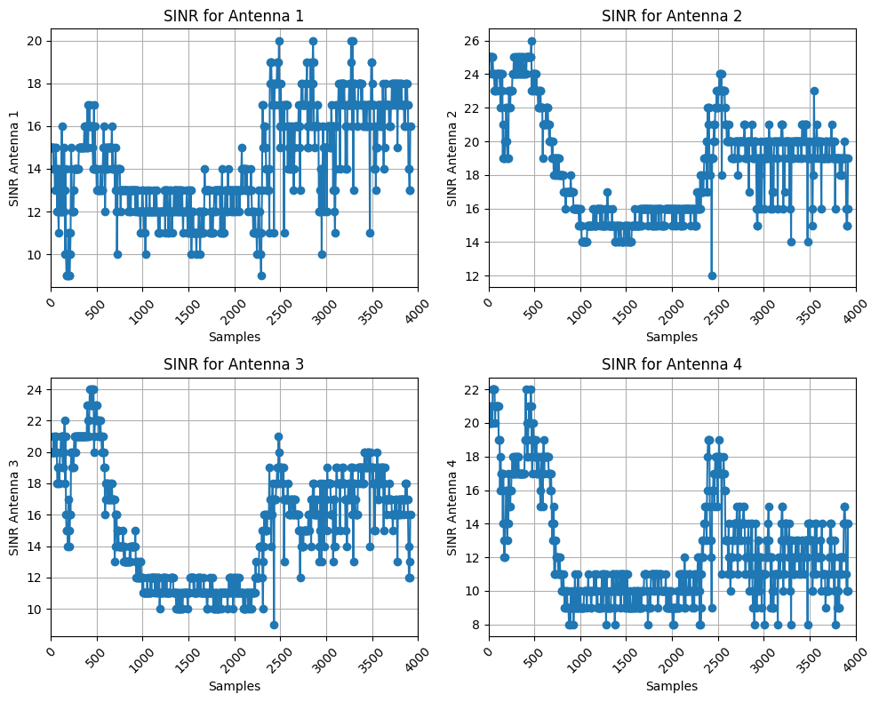

# JamShield: A Machine Learning Detection Algorithm for Over-the-Air Jamming Attacks

This repository contains the dataset used in the research paper "**JamShield: A Machine Learning Detection Algorithm for Over-the-Air Jamming Attacks**." The research was conducted by **Ioannis Panitsas**, **Yagmur Yigit**, **Leandros Tassiulas**, and **Leandros Maglaras** from **Yale University** and **Edinburgh Napier University**.

For any inquiries, please contact Ioannis Panitsas at [ioannis.panitsas@yale.edu](mailto:ioannis.panitsas@yale.edu).

## Threat Model
In this work, we assume that a powerful jammer disrupts all types of communications within a specific frequency range, affecting all three 802.11 user channels (channels 1, 6, and 11) in the 2.4 GHz band by broadcasting Additive White Gaussian Noise (AWGN) or by emitting single tones and pulses. Additionally, we assume that this signal blocks all communications between nodes, thereby partially disabling communication among surrounding nodes within the jamming radius.

## Dataset
Each dataset corresponds to a specific jamming type. We have implemented three types of jammers: constant, random, and reactive, each with varying output power and different jamming signals. We also include datasets without the presence of a jammer. You can access the raw files in the `data` folder:

- [Constant Jammer](data/)
- [Random Jammer](data/)
- [Reactive Jammer](data/)

Each dataset file contains the following features:

| Feature Name                                             | Description                                                                                           |
|---------------------------------------------------------|--------------------------------------------------------------------------------------------------------|
| sample                                                  | Unique identifier for each data sample.                                                                |
| station                                                 | MAC Address for the station transmitting the data.                                                     |
| tx_total_pkts                                           | Total number of packets transmitted.                                                                   |
| tx_total_bytes                                          | Total number of bytes transmitted.                                                                     |
| tx_ucast_pkts                                           | Number of unicast packets transmitted.                                                                 |
| tx_ucast_bytes                                          | Total bytes of unicast packets transmitted.                                                            |
| tx_mcast_bcast_pkts                                     | Number of multicast and broadcast packets transmitted.                                                 |
| tx_mcast_bcast_bytes                                    | Total bytes of multicast and broadcast packets transmitted.                                            |
| tx_failures                                             | Number of transmission failures.                                                                       |
| rx_data_pkts                                            | Number of received data packets.                                                                       |
| rx_data_bytes                                           | Total number of bytes received in data packets.                                                        |
| rx_ucast_pkts                                           | Number of unicast packets received.                                                                    |
| rx_ucast_bytes                                          | Total bytes of unicast packets received.                                                               |
| rx_mcast_bcast_pkts                                     | Number of multicast and broadcast packets received.                                                    |
| rx_mcast_bcast_bytes                                    | Total bytes of multicast and broadcast packets received.                                               |
| rx_decrypt_succeeds                                     | Number of successful decryption attempts for received packets.                                         |
| tx_data_pkts_retried                                    | Number of data packets that were retried for transmission.                                             |
| tx_total_pkts_sent                                      | Total number of packets sent, including retransmissions.                                               |
| tx_pkts_retries                                         | Total number of packet retries during transmission.                                                    |
| tx_pkts_retry_exhausted                                 | Number of packets that reached their retry limit without successful transmission.                      |
| rx_total_pkts_retried                                   | Number of received packets that were retried during reception.                                         |
| rate_last_tx_pkt_min                                    | Minimum transmission rate for the last transmitted packet (in kbps).                                   |
| rate_last_tx_pkt_max                                    | Maximum transmission rate for the last transmitted packet (in kbps).                                   |
| per_antenna_rssi_last_rx_data_frame_1                   | RSSI for the last received data frame on antenna 1.                                                    |
| per_antenna_rssi_last_rx_data_frame_2                   | RSSI for the last received data frame on antenna 2.                                                    |
| per_antenna_rssi_last_rx_data_frame_3                   | RSSI for the last received data frame on antenna 3.                                                    |
| per_antenna_rssi_last_rx_data_frame_4                   | RSSI for the last received data frame on antenna 4.                                                    |
| per_antenna_avg_rssi_rx_data_frames_1                   | Average RSSI for all received data frames on antenna 1.                                                |
| per_antenna_avg_rssi_rx_data_frames_2                   | Average RSSI for all received data frames on antenna 2.                                                |
| per_antenna_avg_rssi_rx_data_frames_3                   | Average RSSI for all received data frames on antenna 3.                                                |
| per_antenna_avg_rssi_rx_data_frames_4                   | Average RSSI for all received data frames on antenna 4.                                                |
| per_antenna_noise_floor_1                               | Noise floor measurement for antenna 1.                                                                 |
| per_antenna_noise_floor_2                               | Noise floor measurement for antenna 2.                                                                 |
| per_antenna_noise_floor_3                               | Noise floor measurement for antenna 3.                                                                 |
| per_antenna_noise_floor_4                               | Noise floor measurement for antenna 4.                                                                 |
| sinr_per_antenna_1                                      | SINR for antenna 1, indicating signal quality.                                                         |
| sinr_per_antenna_2                                      | SINR for antenna 2, indicating signal quality.                                                         |
| sinr_per_antenna_3                                      | SINR for antenna 3, indicating signal quality.                                                         |
| sinr_per_antenna_4                                      | SINR for antenna 4, indicating signal quality.                                                         |
| attack                                                  | Indicator of whether an attack is present (0 for normal operation, 1 for attack).                      |

    
    

## Feature Selection

To identify the most important features from the initial dataset of 40 features collected from our testbed, we employed two key techniques: Principal Component Analysis (PCA) and Mutual Information (MI). PCA was used to transform the 40 original features into a smaller set of principal components, capturing the most significant variance in the data. Meanwhile, MI assessed the relevance of each feature to the target variable (attack presence), highlighting the most critical factors for detection. The results from both methods were integrated using a weighted voting mechanism, which ultimately selected the 20 most relevant features for jamming attack classification. The final set of features selected for jamming attack classification are the following: 

| tx_total_pkts                                           | Total number of packets transmitted.                                                                   |
| tx_total_bytes                                          | Total number of bytes transmitted.                                                                     |
| tx_ucast_pkts                                           | Number of unicast packets transmitted.                                                                 |
| tx_ucast_bytes                                          | Total bytes of unicast packets transmitted.                                                            |
| tx_failures                                             | Number of transmission failures.                                                                       |
| rx_data_pkts                                            | Number of data packets received.                                                                       |
| rx_ucast_pkts                                           | Number of unicast packets received.                                                                    |
| rx_data_bytes                                           | Total bytes received in data packets.                                                                  |
| tx_data_pkts_retried                                    | Number of data packets that required retransmission.                                                   |
| tx_total_pkts_sent                                      | Total number of packets sent, including retransmissions.                                               |
| tx_pkts_retries                                         | Total number of packet retransmission attempts.                                                        |
| tx_pkts_retry_exhausted                                 | Number of packets that exhausted all retry attempts without success.                                   |
| rate_last_tx_pkt_min                                    | Minimum transmission rate of the last transmitted packet (in kbps).                                    |
| rate_last_tx_pkt_max                                    | Maximum transmission rate of the last transmitted packet (in kbps).                                    |
| per_antenna_rssi_last_rx_data_frame_1                   | RSSI for the last received data frame on antenna 1.                                                    |
| per_antenna_rssi_last_rx_data_frame_2                   | RSSI for the last received data frame on antenna 2.                                                    |
| per_antenna_avg_rssi_rx_data_frames_1                   | Average RSSI for all received data frames on antenna 1.                                                |
| per_antenna_avg_rssi_rx_data_frames_2                   | Average RSSI for all received data frames on antenna 2.                                                |
| sinr_per_antenna_1                                      | Signal-to-Interference-plus-Noise Ratio (SINR) for antenna 1, indicating signal quality.                
| per_antenna_noise_floor_1                               | Noise floor measurement for antenna 1, indicating background noise level.                              

## Implementation (Flow Graph)
The jammers were implemented using GNURadio. Below is one the flow graphs that were used for implementing the jammers.

## Testbed Setup 
Our experimental setup is deployed in an area of 80 m². It includes three fixed-position wireless nodes, two OnePlus 8T smartphones, one wireless access point (AP), one USRP X310, and one edge server (for training/inference of our ML model).

- **Wireless Nodes:** Each wireless node is a Linux PC with an Intel WLAN 8265/8275 wireless network adapter supporting 802.11 standards.

- **OnePlus 8T Smartphones:** Each smartphone is equipped with the Qualcomm FastConnect 6900 Wi-Fi chipset. During our experiments, the smartphones were placed in various locations within the lab at random intervals.

- **Wireless Access Point (AP):** In this work, we utilized the ASUS RT-AX88U Pro as the AP. This device supports wireless standards, including 802.11, and operates simultaneously in dual-band (2.4 GHz and 5 GHz) modes. It features 2x2 antennas for enhanced beamforming and supports channel capacities ranging from 20 to 160 MHz, with a maximum output power of 20 dBm.

- **USRP X310:** For generating and transmitting malicious interference signals, we employed the USRP X310 radio from Ettus Research. This open-source Software Defined Radio (SDR) platform features two extended-bandwidth daughter-board slots, supporting frequencies ranging from 10 MHz to 6 GHz. It is equipped with two individually configurable RF channels, each capable of operating at a maximum sample rate of 200 Msps and providing an adequate bandwidth of 160 MHz. Additionally, it has a maximum output power exceeding 20 dBm.

- **Edge Server:** For the training and inference of our proposed **JamShield** ML-based model, we utilized a customized edge server equipped with an AMD EPYC 7352 2.3 GHz 24-core processor, 128 GB of DDR4 RAM, and four NVIDIA RTX A5000 GPUs, each with 24 GB of memory.
  
The testbed setup for the experiments is illustrated below:

     
    

### Reference Scenarios

To mimic both ideal and challenging link characteristics, we considered two different configurations, referred to as the Line Of Sight (LOS) scenario and the Non-Line Of Sight (NLOS) scenario. In the first scenario, we deployed the jammer in the middle of the lab at a height of three meters, with the wireless nodes positioned around the lab at a distance of six meters and at a height of one meter. The jammer maintained a LOS with the wireless nodes, allowing it to generate interference signals that propagated directly to them without obstruction or multipath reflection. In the second scenario, the jammer was placed in a different location, at a height of one meter. To create an NLOS condition, we obstructed the jammer’s signals with a metallic surface and reduced the transmit power by adding attenuation elements at
the output of the radio front-end.

     
    

